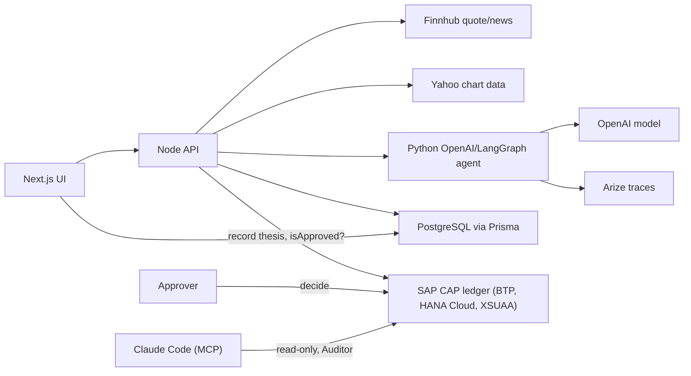

# Shadow Trader

[](https://github.com/mastroevan/shadow-trader/actions/workflows/ci.yml)

Shadow Trader is a personal AI market research project: enter a ticker, and the agent gathers live quote data, recent headlines, technical signals, and observability metadata, then turns that evidence into a directional thesis and a watchlist action plan.

Focus area: **Financial Services**

Observability: **Arize**

Arize/OpenTelemetry traces make each AI agent run inspectable and debuggable. The trace id is returned in the UI and can be used to inspect the agent run in Arize.

## What It Does

- Fetches live quote and recent company news from Finnhub.
- Adds technical context with a 20-day SMA trend signal.
- Sends quote, signals, and headlines to an OpenAI/LangGraph Python agent.
- Lets the user pick the market while the AI chooses strategy, analysis timeframe, expected hold, setup type, bias, and confidence.
- Produces a structured thesis with exactly two bullish and two bearish factors.
- Generates an actionable watchlist plan with trigger, invalidation, watch conditions, entry zone, stop loss, take profit, risk/reward, and warnings.
- Handles watchlist eligibility from confidence: `75%+` auto-adds, `60-74%` requires manual review, and below `60%` is rejected from watchlist tracking.
- Saves watchlist, paper-trade, ledger, and thesis records through the Node API.
- Emits Arize-compatible trace metadata for agent observability.
- Records every trade thesis and risk assessment in an SAP CAP ledger on BTP, and opens no paper trade until a human approval is recorded there (see [Human approval ledger](#human-approval-ledger-sap-btp)).

## Architecture



## Human approval ledger (SAP BTP)

An AI agent proposes trades; a person decides. Every thesis and risk assessment is written
to an append-only ledger, tied to whoever wrote it, and no paper trade opens until a human
has approved it there.

The ledger is a SAP CAP (Node.js) service in [`apps/ledger`](apps/ledger): one service for the
app (`LedgerService`), one read-only MCP service for assistants (`AuditService`), three
tables and three roles.

| Role | Held by | Can do |
| --- | --- | --- |
| `LedgerWriter` | The Shadow Trader API, acting for the agent (XSUAA client credentials) | Record theses and risk assessments, read, call `isApproved` |
| `Approver` | A human (user token) | Read, call `decide` |
| `Auditor` | Claude Code over MCP, reviewers | Read through `AuditService` only |

How the gate works: when someone opens a paper trade, the API records the thesis in the
ledger and refuses (`409 AWAITING_LEDGER_APPROVAL`) until an Approver has called `decide`.
If the ledger can't be reached, it refuses with `503`. The agent's credentials only carry
`LedgerWriter`, so it can never approve, and a test asserts the 403.

| Piece | Where it runs |
| --- | --- |
| `LedgerService` (record, `decide`, `isApproved`) | Deployed on BTP Cloud Foundry, HANA Cloud HDI container, XSUAA |
| `AuditService` over MCP (`/mcp/audit`) | Local and hybrid; next deploy brings it to BTP |
| Approvals | `decide` via [`LedgerService.http`](apps/ledger/test/http/LedgerService.http) or curl; dashboard buttons are not built yet |
| Tests | 66 Jest tests (`cds.test`, in-memory SQLite) in the `Ledger` CI job |
| Gate in the hosted app (Render) | Not yet: `LEDGER_*` variables aren't set there, so it runs without the gate |

Run it locally (Node 24.9+):

```bash
cd apps/ledger
nvm use && npm install
npm run watch                  # http://localhost:4004, SQLite, mock users agent / evan / auditor
npm test                       # Jest
cds watch --profile hybrid     # same, against HANA Cloud (after `cds bind` to your HDI container)
```

Set `LEDGER_URL=http://localhost:4004` and `LEDGER_USERNAME=agent` in `.env` and restart the
API to turn the gate on; without `LEDGER_URL` it is skipped.

More detail: [ledger readme](apps/ledger/readme.md) (rules, roles, deploy) ·
[MCP tool-description eval](apps/ledger/test/evals/mcp-questions.md) ·
[build log](apps/ledger/BUILD_LOG.md)

## Demo Flow

1. Open the app.
2. Select `crypto` or `stock`, then enter a symbol or click a demo ticker.
3. Click `Scan Setup`.
4. Review the AI Analysis output: strategy, trading style, analysis timeframe, expected hold, setup type, bias, confidence, and reason.
5. Point out the trace id and Arize observability hook.
6. Explain the confidence decision: high-confidence setups are added automatically, moderate-confidence setups can be added manually, and low-confidence setups are rejected from watchlist tracking.

## Local Setup

Copy the example environment file:

```bash
cp .env.example .env
```

Install dependencies:

```bash
cd apps/web && npm install
cd ../api && npm install
cd ../agent && python3 -m venv venv && source venv/bin/activate && pip install -r requirements.txt
```

Create a local Postgres database, then run Prisma migrations:

```bash
createdb shadow_trader
cd apps/api
npx prisma migrate dev
```

Run the services in three terminals:

```bash
cd apps/agent
source venv/bin/activate
uvicorn server:app --reload --port 8000
```

```bash
cd apps/api
npm run dev
```

```bash
cd apps/web
npm run dev
```

Open [http://localhost:3000](http://localhost:3000).

## Environment Variables

Required:

- `DATABASE_URL`
- `FINNHUB_API_KEY`
- `OPENAI_API_KEY`
- `OPENAI_MODEL_FAST` defaults to `gpt-5.4-mini`
- `OPENAI_MODEL_DEEP` defaults to `gpt-5.5`
- `INTERNAL_API_KEY`
- `AUTH_SECRET`
- `AUTH_URL`
- `AUTH_GITHUB_ID`
- `AUTH_GITHUB_SECRET`

Optional:

- `AGENT_URL`
- `AGENT_TIMEOUT_MS`
- `ARIZE_API_KEY`
- `ARIZE_SPACE_KEY`
- `NEXT_PUBLIC_FRONTEND_URL`
- `API_INTERNAL_BASE_URL`
- `AUTH_ALLOWED_EMAILS`
- `AUTOMATION_ENABLED`
- `AUTOMATION_INTERVAL_MS`
- `AUTOMATION_ENTRY_MOVE_PCT`
- `STARTUP_SCAN_ENABLED` defaults to `true`; set to `false` to disable startup scans
- `STARTUP_SCAN_STOCK_TICKERS` defaults to `NVDA,AAPL,MSFT,TSLA,META`
- `STARTUP_SCAN_CRYPTO_TICKERS` defaults to `BTC/USD,ETH/USD,SOL/USD`
- `STARTUP_SCAN_TICKERS` optional mixed list; supports values like `stock:AMD,crypto:BTC/USD`
- `STARTUP_SCAN_MIN_CONFIDENCE` defaults to `0.75`
- `STARTUP_SCAN_TIMEFRAME` defaults to `5m`
- `PORT`

## Deployment

Hosted demo target: [https://shadow-trader-web.onrender.com](https://shadow-trader-web.onrender.com)

This repo includes a Render Blueprint at `render.yaml` plus Dockerfiles for the web, API, and agent services. See [docs/deployment.md](docs/deployment.md) for the exact environment variables and deployment order.

## Proof Run

With all three services running, execute:

```bash
npm run proof:e2e:btc -- --write
```

The script runs `BTC/USD`, requires a real AI agent response, confirms Coinbase quote/candle data, saves the watchlist entry, opens and closes a paper trade, and can write a local proof JSON when `-- --write` is included.

## Project Notes

- Hosted project URL: `https://shadow-trader-web.onrender.com`
- License: included in this repository.
- Personal walkthrough target: about 3 minutes.
- Primary use case: Financial Services market research workflow.

## Arize / Agent Builder

Connect the same Arize project to your observability workflow to inspect agent runs, compare thesis quality, and debug failures. The app sends agent traces to Arize through OpenTelemetry when `ARIZE_API_KEY` and `ARIZE_SPACE_KEY` are configured.
