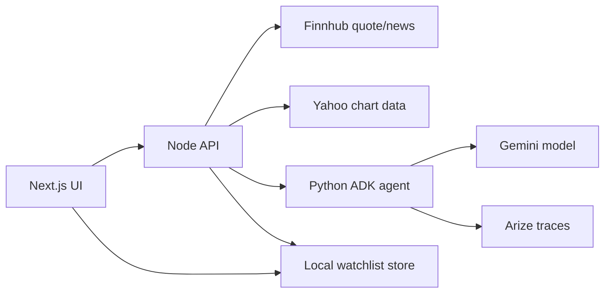

# Shadow Trader

Shadow Trader is an AI market research agent for hackathon judges to test quickly: enter a ticker, and the agent gathers live quote data, recent headlines, technical signals, and observability metadata, then turns that evidence into a directional thesis and a watchlist action plan.

Hackathon track: **Financial Services**

Partner track: **Arize**

Partner superpower: Arize/OpenTelemetry traces make each Gemini agent run inspectable, debuggable, and judge-friendly. The trace id is returned in the UI and can be used to inspect the agent run in Arize.

## What It Does

- Fetches live quote and recent company news from Finnhub.
- Adds technical context with a 20-day SMA trend signal.
- Sends quote, signals, and headlines to a Gemini-powered Python ADK agent.
- Produces a structured thesis with exactly two bullish and two bearish factors.
- Generates an actionable watchlist plan with trigger, invalidation, and watch conditions.
- Saves the plan to a local watchlist through the Node API.
- Emits Arize-compatible trace metadata for agent observability.

## Architecture



## Demo Flow

1. Open the app.
2. Click `NVDA` or another demo ticker.
3. Show the quote card, signal cards, headlines, and AI thesis.
4. Point out the trace id and Arize observability hook.
5. Click `Add to Watchlist`.
6. Explain that the agent moved from analysis into a saved watchlist setup.

## Local Setup

Copy the example environment file:

```bash
cp .env.example .env
```

Install dependencies:

```bash
cd apps/web && npm install
cd ../api && npm install
cd ../agent && python3 -m venv venv && source venv/bin/activate && pip install -r requirements.txt
```

Run the services in three terminals:

```bash
cd apps/agent
source venv/bin/activate
uvicorn server:app --reload --port 8000
```

```bash
cd apps/api
npm run dev
```

```bash
cd apps/web
npm run dev
```

Open [http://localhost:3000](http://localhost:3000).

## Environment Variables

Required:

- `FINNHUB_API_KEY`
- `GOOGLE_API_KEY`
- `GEMINI_MODEL` defaults to `gemini-2.5-pro`
- `ARIZE_API_KEY`
- `ARIZE_SPACE_KEY`

Optional:

- `AGENT_URL`
- `NEXT_PUBLIC_FRONTEND_URL`
- `PORT`

## Deployment

Hosted demo target: [https://shadow-trader-web.onrender.com](https://shadow-trader-web.onrender.com)

This repo includes a Render Blueprint at `render.yaml` plus Dockerfiles for the web, API, and agent services. See [docs/deployment.md](docs/deployment.md) for the exact environment variables and deployment order.

## Proof Run

With all three services running, execute:

```bash
npm run proof:e2e -- --write
```

The script runs `NVDA`, requires a real Gemini agent response, confirms Finnhub quote/news data, saves the watchlist entry, and writes sanitized proof to `docs/proof/latest-e2e-proof.json`.

Latest local proof summary: [docs/proof/phase-9-10-live-proof.md](docs/proof/phase-9-10-live-proof.md)

## Submission Notes

- Hosted project URL: `https://shadow-trader-web.onrender.com`
- Public repository URL: add the GitHub URL in Devpost after publishing.
- License: included in this repository.
- Demo video target: about 3 minutes.
- Track selection: Arize partner bucket, Financial Services use case.
- Devpost checklist: [docs/devpost-checklist.md](docs/devpost-checklist.md)

## Arize / Agent Builder Qualification

For the hackathon submission, connect the same Arize project to the Arize MCP server in Google Cloud Agent Builder. Use the trace id shown in Shadow Trader to inspect agent runs, compare thesis quality, and debug failures. The app already sends ADK traces to Arize through OpenTelemetry when `ARIZE_API_KEY` and `ARIZE_SPACE_KEY` are configured.
